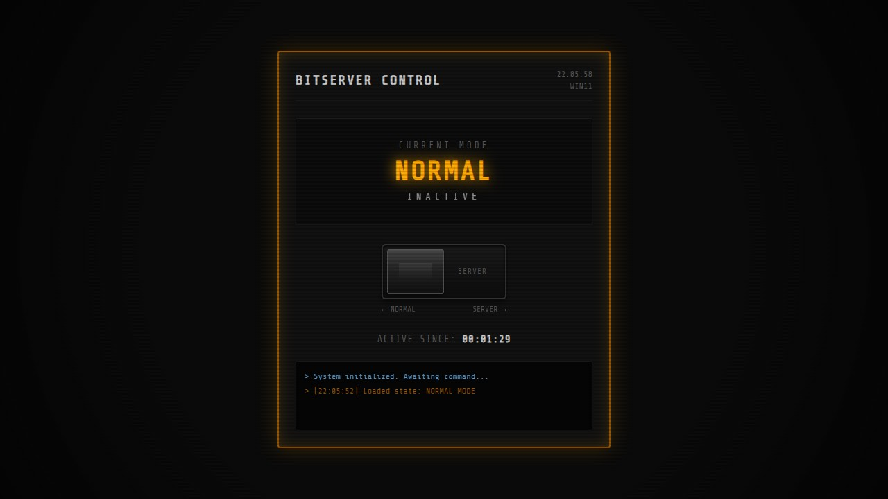

<div align="center">
  
  
  
  
  <br/><br/>
  <h1>🖥️ BITSERVER CONTROL</h1>
  <p><strong>Toggle your Windows 11 PC between Normal and Server mode — from a beautiful web UI.</strong></p>
  <p>Keep your machine awake 24/7 for servers, mining, downloads, or OpenClaw — or restore normal power settings with one click.</p>
  <br/>
  
</div>

---

## ✨ Features

- **⚡ One-click toggle** — Switch between NORMAL and SERVER mode instantly
- **🎨 Beautiful dark UI** — Modern glass-morphism design with smooth animations
- **🔧 No bloat** — Single Node.js + Express backend, minimal dependencies
- **🛡️ Settings backup** — Your original power settings are saved and restored
- **📡 REST API** — Control programmatically via `/server-mode` and `/normal-mode`
- **🔊 Sound feedback** — Satisfying click sounds on mode change

## 📋 How it works

BITSERVER CONTROL uses Windows built-in `powercfg` tool to change power plan settings. No external services, no telemetry, no accounts.

| Setting | NORMAL Mode | SERVER Mode |
|---------|:-----------:|:-----------:|
| 🖥️ Monitor timeout | 15 min (AC) / 10 min (DC) | Never |
| 💤 Sleep timeout | 30 min | Never |
| 💾 Hibernate | Off | Off |
| 🔒 Lid close (laptops) | Sleep | Do nothing |

## 🚀 Getting Started

### Prerequisites

- **Windows 11** (may work on 10, untested)
- **Node.js** ≥ 18 ([download](https://nodejs.org))

### Installation

```bash
# Clone or download the project
cd bitserver-control

# Install dependencies
npm install
```

### Usage

```bash
# Run as Administrator (required for powercfg changes)
# Option 1: Double-click run.bat (Run as administrator)
# Option 2: Terminal
npm start
```

Then open **http://localhost:3131** in your browser.

> ⚠️ **Important:** Right-click `run.bat` → **Run as administrator**. The app needs elevated privileges to change power settings.

## 🌐 API Reference

| Method | Endpoint | Description |
|--------|----------|-------------|
| `GET` | `/state` | Get current mode: `{"mode":"normal"\|"server","since":"ISO date"}` |
| `POST` | `/server-mode` | Activate Server Mode (no sleep, no monitor off) |
| `POST` | `/normal-mode` | Restore normal power settings |

### Example

```bash
# Check current state
curl http://localhost:3131/state

# Toggle to Server Mode
curl -X POST http://localhost:3131/server-mode

# Restore Normal Mode
curl -X POST http://localhost:3131/normal-mode
```

## 📁 Project Structure

```
bitserver-control/
├── server.js         # Express server + powercfg commands
├── app.html          # Web UI (dark theme, toggle switch)
├── run.bat           # Windows batch launcher
├── package.json
├── README.md
├── LICENSE
└── .gitignore
```

## 🛠️ Tech Stack

- **Backend:** Node.js + Express
- **Frontend:** Vanilla HTML/CSS/JS (no frameworks)
- **OS API:** Windows `powercfg` (native)
- **Dependencies:** 1 (express)

## 📜 License

MIT — do whatever you want.

---

<div align="center">
  <sub>Built with ❤️ by <strong>Tobias</strong> · 
  <a href="https://github.com/TboyDev">GitHub</a></sub>
</div>
